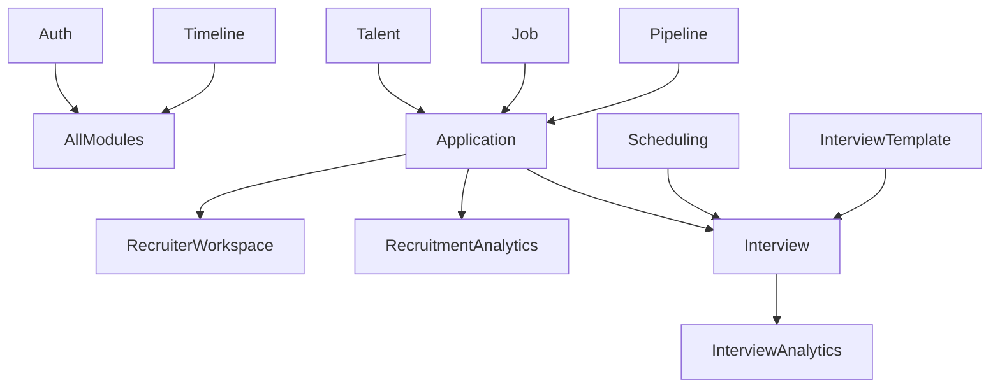
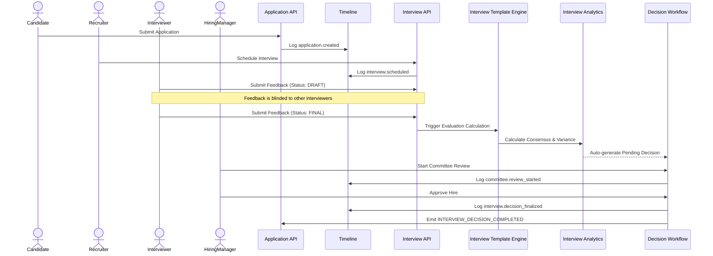

# RecruitPilot Backend - Technical Handoff

This document provides a comprehensive technical handoff of the RecruitPilot Backend (Milestones 1–4) for frontend integration and UI development.

## 1. Architecture Overview
RecruitPilot is engineered as a **Modular Monolith** using **NestJS**. 
- **Core Paradigm:** Domain-Driven Design (DDD) principles where every major business entity is isolated into its own module.
- **Database:** **MongoDB** (via Mongoose).
- **Communication:** Synchronous REST APIs coupled with Asynchronous internal messaging via `EventEmitter2` for side-effects (e.g., Timeline logging, snapshot creation).
- **Multi-Tenancy:** Hard-enforced Company-scoped architecture. Every entity contains a `companyId`.

## 2. Folder Structure
```text
apps/backend/src/
├── app.module.ts                   # Root module tying everything together
├── modules/
│   ├── auth/                       # JWT Authentication & RBAC Guards
│   ├── company/                    # Multi-tenancy definitions
│   ├── talent/                     # CRM: Candidates, Talent Pools
│   ├── job/                        # Job Management (Draft/Published, Requisitions)
│   ├── application/                # Core Applications & Snapshots
│   ├── recruiter-workspace/        # Note-taking, Collaboration, Application Views
│   ├── hiring-pipeline/            # Pipeline configurations & Stage transitions
│   ├── timeline/                   # Immutable event-sourcing ledger (Audit trails)
│   ├── recruitment-analytics/      # Pipeline analytics, conversion metrics
│   ├── interview/                  # Standalone Interview entity, scheduling, feedback
│   ├── scheduling/                 # ICS generation, Timezone handling, Availabilities
│   ├── interview-template/         # Question Banks, Competencies, Scorecards
│   └── interview-analytics/        # Consensus generation, Decision workflows, Committee
```

## 3. Database Schema Documentation
The MongoDB schemas are heavily normalized but utilize strategic sub-documents and immutable snapshots for historical integrity.

**Core Collections:**
- `Companies` & `Users` (Identity and Multi-Tenancy)
- `Candidates` & `TalentPools` (Talent CRM)
- `Jobs` & `JobRequisitions` (Requisition Engine)
- `Applications` (Links Candidate to Job)
- `Pipelines` (Defines custom stages per Job)
- `Timelines` (Append-only event ledger for auditing)
- `RecruitmentMetrics` (Aggregated reporting snapshots)
- `Interviews` (Complete hiring events with panel members & Draft/Final feedback)
- `Competencies`, `Questions`, `ScorecardTemplates`, `InterviewTemplates` (Evaluation Engine Master Data)
- `InterviewDecisions` (1:1 with Interviews, houses committee reviews and Consensus logic)

## 4. Complete API Inventory & Swagger Endpoint Summary
All endpoints are prefixed with `/api/v1/` and protected by `JwtAuthGuard`.

| Module | Core Endpoints | Purpose |
|--------|----------------|---------|
| **Jobs** | `GET /jobs`, `POST /jobs` | Create and publish requisitions. |
| **Talent** | `POST /talent/candidates`, `GET /talent/pools` | Manage talent CRM. |
| **Applications** | `POST /applications`, `GET /applications/:id` | Submit and retrieve candidate applications. |
| **Pipeline** | `POST /pipeline/stages/move` | Transition an application from one stage to another. |
| **Workspace** | `POST /workspace/notes`, `GET /workspace/dashboard` | Recruiter collaboration and high-level dashboard. |
| **Analytics** | `GET /analytics/pipeline-health` | High-level conversion reporting. |
| **Interviews** | `POST /interviews/schedule`, `POST /interviews/:id/feedback` | Schedule interviews and submit blinded panel feedback. |
| **Templates** | `POST /interview-templates`, `POST /interview-templates/questions` | Manage reusable question banks and competencies. |
| **Interview Analytics**| `GET /interview-analytics/dashboard`, `POST /interview-analytics/interviews/:id/decision`| Read consensus, advance committee workflow, evaluate interviewer metrics. |

## 5. Event Catalog (Internal `EventEmitter2`)
The platform uses events extensively to decouple side effects.
- **Application Lifecycle:** `application.created`, `application.stage_moved`, `application.rejected`
- **Interview Lifecycle:** `interview.scheduled`, `interview.rescheduled`, `interview.feedback_submitted`, `interview.evaluation_completed`
- **Decision Engine:** `CONSENSUS_GENERATED`, `DECISION_SUBMITTED`, `COMMITTEE_REVIEW_STARTED`, `COMMITTEE_REVIEW_COMPLETED`, `DECISION_FINALIZED`, `INTERVIEW_DECISION_COMPLETED`

## 6. Module Dependency Diagram


## 7. RBAC Matrix
The platform relies on dynamic Role-Based Access Control mapped via JWT tokens.

| Action | Admin | Recruiter | Hiring Manager | Interviewer | Candidate |
|--------|-------|-----------|----------------|-------------|-----------|
| **View Jobs** | ✅ | ✅ | ✅ | ✅ | ✅ (Public) |
| **Move Pipeline Stage** | ✅ | ✅ | ❌ | ❌ | ❌ |
| **View Candidate Resume**| ✅ | ✅ | ✅ | ❌ | ❌ |
| **Schedule Interview** | ✅ | ✅ | ❌ | ❌ | ❌ |
| **Submit Feedback** | ✅ | ✅ | ✅ | ✅ | ❌ |
| **View Unblinded Feedback**| ✅ | ✅ | ✅ | ❌ | ❌ |
| **Approve Final Decision**| ✅ | ❌ | ✅ | ❌ | ❌ |

## 8. Environment Variables
Required `.env` configuration:
```env
PORT=3000
MONGO_URI=mongodb://localhost:27017/recruitpilot
JWT_SECRET=your_super_secret_jwt_key
```

## 9. Setup Guide
1. Ensure MongoDB is running locally or provide a valid Atlas URI.
2. Run `npm install`
3. Run `npm run start:dev` (or `npx tsc` to verify compilation).
4. Swagger Documentation is available at `http://localhost:3000/api` (if Swagger setup is active in `main.ts`).

## 10. Sequence Diagrams

### Core Workflow: Candidate → Apply → Interview → Decision



## 11. Known TODOs and Extension Points (Future Milestones)
- **AI Intelligence:** The foundational schemas (Feedback, Insights, Vetoes) are explicitly designed to be interceptable by an AI agent (e.g. AI generating the "Notes" or identifying "Red Flags").
- **Calendar Provider Integrations:** The `SchedulingModule` currently uses the `ics` library to generate agnostic files. A `GoogleCalendarAdapter` and `MicrosoftGraphAdapter` can be plugged in seamlessly.
- **Offer Management:** Catching the `INTERVIEW_DECISION_COMPLETED` event to trigger Offer Letter Generation and Document Signing (Milestone 5).
- **External Communications:** Triggering real email/SMS dispatches on `Timeline` events.
