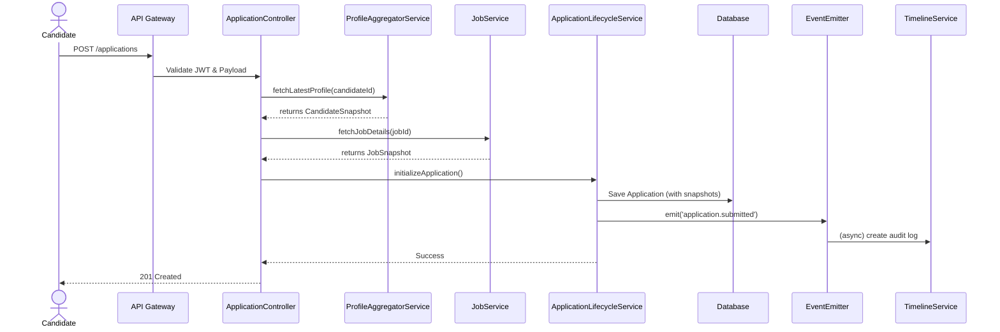
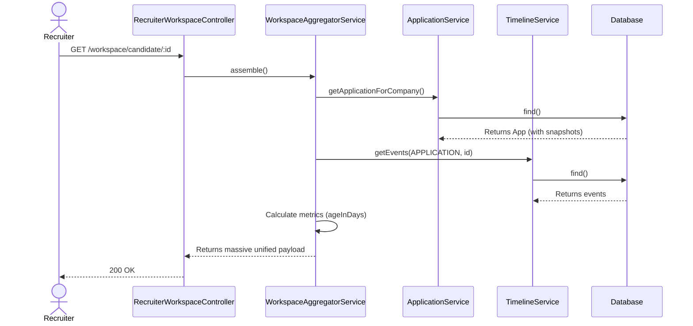

# Sequence Diagrams

## Candidate Application Submission

```mermaid
sequenceDiagram
    actor Candidate
    participant API Gateway
    participant ApplicationController
    participant ProfileAggregatorService
    participant JobService
    participant ApplicationLifecycleService
    participant Database

    Candidate->>API Gateway: POST /applications
    API Gateway->>ApplicationController: Validate JWT & Payload
    ApplicationController->>ProfileAggregatorService: fetchLatestProfile(candidateId)
    ProfileAggregatorService-->>ApplicationController: returns CandidateSnapshot
    ApplicationController->>JobService: fetchJobDetails(jobId)
    JobService-->>ApplicationController: returns JobSnapshot
    ApplicationController->>ApplicationLifecycleService: initializeApplication()
    ApplicationLifecycleService->>Database: Save Application (with snapshots)
    ApplicationLifecycleService->>EventEmitter: emit('application.submitted')
    EventEmitter->>TimelineService: (async) create audit log
    ApplicationLifecycleService-->>ApplicationController: Success
    ApplicationController-->>Candidate: 201 Created
```

## Recruiter Workspace Aggregation

```mermaid
sequenceDiagram
    actor Recruiter
    participant RecruiterWorkspaceController
    participant WorkspaceAggregatorService
    participant ApplicationService
    participant TimelineService
    participant Database

    Recruiter->>RecruiterWorkspaceController: GET /workspace/candidate/:id
    RecruiterWorkspaceController->>WorkspaceAggregatorService: assemble()
    WorkspaceAggregatorService->>ApplicationService: getApplicationForCompany()
    ApplicationService->>Database: find()
    Database-->>ApplicationService: Returns App (with snapshots)
    WorkspaceAggregatorService->>TimelineService: getEvents(APPLICATION, id)
    TimelineService->>Database: find()
    Database-->>TimelineService: Returns events
    WorkspaceAggregatorService->>WorkspaceAggregatorService: Calculate metrics (ageInDays)
    WorkspaceAggregatorService-->>RecruiterWorkspaceController: Returns massive unified payload
    RecruiterWorkspaceController-->>Recruiter: 200 OK
```
